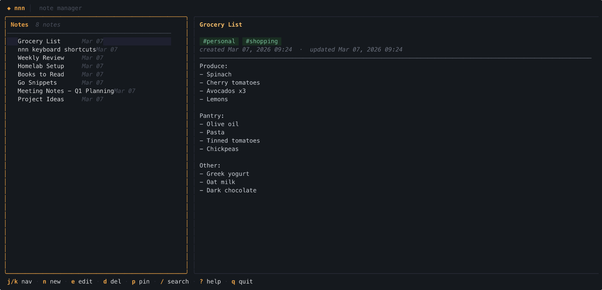

# nnn



A fast, keyboard-driven terminal note manager built with [Bubble Tea](https://github.com/charmbracelet/bubbletea).

Two ways to use it: open the full TUI with `nnn`, or drive it from the command line for scripting and quick capture.

---

## Install

### Homebrew (macOS / Linux)

```sh
brew install antoniocali/tap/nnn
```

### Go install

```sh
go install github.com/antoniocali/nnn/cmd/nnn@latest
```

### Download a binary

Grab the latest release from the [releases page](https://github.com/antoniocali/nnn/releases), extract the archive, and place `nnn` somewhere on your `$PATH`.

### Build from source

Requires Go 1.21+.

```sh
git clone https://github.com/antoniocali/nnn.git
cd nnn
make install   # builds and copies to ~/.local/bin/nnn
```

---

## TUI

Run `nnn` with no arguments to open the interface.

```
┌─ nnn ──────────────────────────────────────────────────────────────────────┐
│                                                                            │
│  ╭─ Notes ─ 3 notes ──╮  ╭─────────────────────────────────────────────╮  │
│  │ Notes        3     │  │ Meeting notes                               │  │
│  │ ────────────────── │  │ #work #meetings                             │  │
│  │ ⏺ Meeting notes    │  │ created Mar 07, 2026  · updated Mar 07, 2026│  │
│  │   Ideas     Mar 07 │  │ ─────────────────────────────────────────── │  │
│  │   First note Mar 07│  │ - Discussed Q1 roadmap                      │  │
│  ╰────────────────────╯  │ - Assigned tasks to team                    │  │
│                          │ - Follow up next week                       │  │
│                          ╰─────────────────────────────────────────────╯  │
│                                                                            │
│  j/k nav · n new · e edit · d del · p pin · / search · ? help · q quit   │
└────────────────────────────────────────────────────────────────────────────┘
```

### Layout

The screen is split into two panels:

- **Left** — scrollable list of all notes, sorted by pin status then last updated. Pinned notes are marked with `⏺`.
- **Right** — the selected note's full content (title, tags, timestamps, body), or the editor when creating/editing.

### Navigation

| Key | Action |
|---|---|
| `j` / `↓` | Move down |
| `k` / `↑` | Move up |
| `g` / `Home` | Jump to top |
| `G` / `End` | Jump to bottom |
| `Enter` / `l` / `→` | Open note in detail view |
| `h` / `←` / `Esc` | Back to list |

### Notes

| Key | Action |
|---|---|
| `n` | New note |
| `e` | Edit selected note |
| `d` | Delete (asks `y/n`) |
| `p` | Toggle pin |
| `r` | Reload from disk |

### Editor

Press `n` (new) or `e` (edit) to enter the editor. There are three fields — cycle through them with `Tab`.

| Key | Action |
|---|---|
| `Tab` | Cycle: Title → Body → Tags |
| `Ctrl+S` | Save and return to list |
| `Ctrl+W` | Save and open detail view |
| `Esc` | Cancel (discard changes) |
| `Ctrl+K` | Delete to end of line |
| `Ctrl+A` / `Home` | Start of line |
| `Ctrl+E` / `End` | End of line |

Tags are entered as a comma-separated string in the Tags field, e.g. `work, ideas, personal`.

### Search

| Key | Action |
|---|---|
| `/` | Start live search (filters list as you type) |
| `Esc` | Clear search and restore full list |
| `Enter` | Confirm and return to list |

Search matches against both title and body (case-insensitive).

### Other

| Key | Action |
|---|---|
| `?` | Toggle help overlay (scrollable with `j`/`k`) |
| `q` / `Ctrl+C` | Quit |

---

## CLI

All subcommands work without opening the TUI, making `nnn` easy to integrate with scripts and other tools.

### `nnn create`

Create a note without opening the TUI.

```sh
nnn create "Title"
nnn create "Meeting notes" --body "- Item one\n- Item two"
nnn create "Idea" --tags work,ideas
```

| Flag | Short | Description |
|---|---|---|
| `--body` | `-b` | Note body (`\n` is interpreted as a newline) |
| `--tags` | `-t` | Comma-separated tags |

### `nnn list`

Print all notes as a table. Pipe-friendly.

```sh
nnn list
nnn list --filter "meeting"
nnn list --json
nnn list --json | jq '.[].title'
```

| Flag | Short | Description |
|---|---|---|
| `--filter` | `-f` | Case-insensitive substring filter on title and body |
| `--json` | | Output full notes as a JSON array |

### `nnn find`

Fuzzy-search notes interactively using [fzf](https://github.com/junegunn/fzf). Prints the selected note's title and body to stdout.

```sh
nnn find
nnn find | pbcopy   # copy note body to clipboard (macOS)
```

Requires `fzf` to be installed. Install with `brew install fzf` or see [fzf's install guide](https://github.com/junegunn/fzf#installation).

### `nnn delete`

Delete a note by its ID or any unique prefix of its ID.

```sh
nnn delete abc12345
nnn delete abc12345 --force   # skip confirmation
```

| Flag | Short | Description |
|---|---|---|
| `--force` | `-f` | Skip the `y/N` confirmation prompt |

### `nnn purge`

Permanently delete the entire `notes.json` file. All notes are lost and this cannot be undone.

```sh
nnn purge
nnn purge --force   # skip confirmation
```

| Flag | Short | Description |
|---|---|---|
| `--force` | `-f` | Skip the `y/N` confirmation prompt |

### `nnn path`

Print the path to the notes file. Useful for backups or manual editing.

```sh
nnn path
# /Users/you/.config/nnn/notes.json
```

---

## Data storage

Notes are stored as a single JSON file on disk.

| Platform | Path |
|---|---|
| macOS / Linux | `~/.config/nnn/notes.json` |
| Windows | `%AppData%\nnn\notes.json` |

The file is human-readable and easy to back up, sync with git, or process with `jq`.

```jsonc
{
  "notes": [
    {
      "id": "466d326a-9345-4f15-97d2-6746f19811b8",
      "title": "Ideas",
      "body": "1. Build a better mousetrap\n2. Write more tests",
      "created_at": "2026-03-07T07:50:48Z",
      "updated_at": "2026-03-07T07:50:48Z",
      "tags": ["ideas"],
      "pinned": false
    }
  ]
}
```

---

## Development

```sh
make build        # build ./nnn
make run          # build and launch the TUI
make test         # run tests with race detector
make check        # fmt + vet + test
make build-all    # cross-compile for all platforms into dist/
make install      # install to ~/.local/bin/nnn
make clean        # remove build artifacts
```

Run `make help` for the full list of targets.

### Releasing

Releases are automated via [GoReleaser](https://goreleaser.com) and GitHub Actions. Tag a commit to trigger a release:

```sh
git tag v1.0.0
git push origin v1.0.0
```

This builds binaries for all platforms, publishes a GitHub Release, and updates the Homebrew formula automatically.

---

## License

MIT
